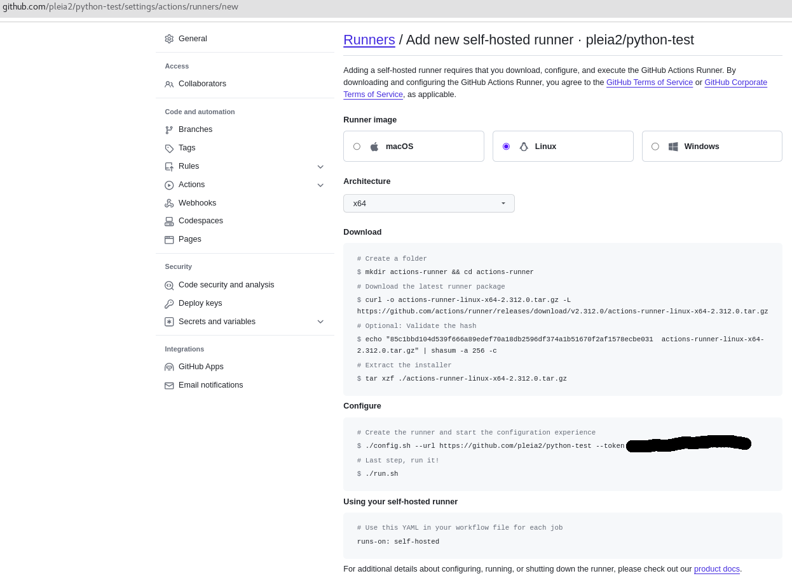
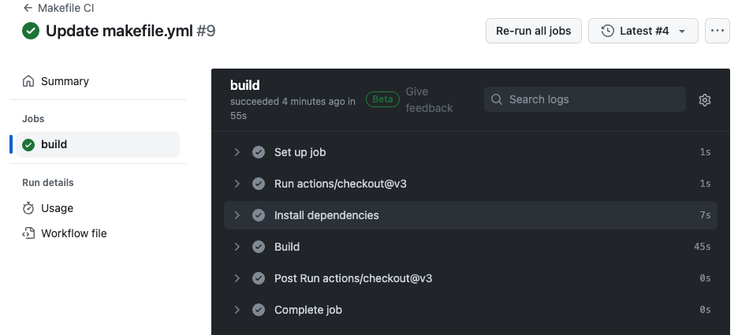

# gaplib
GitHub Actions on Power and Z OCI and LXD Image Build
- [gaplib](#gaplib)
  - [What is it](#what-is-it)
  - [Building](#building)
    - [LXD Image used by Actions Runner](#lxd-image-used-by-actions-runner)
      - [Pre-reqs](#pre-reqs)
      - [Running Build](#running-build)
    - [OCI Image used as Self-Hosted Action Runner](#oci-image-used-as-self-hosted-action-runner)
      - [Pre-reqs](#pre-reqs-1)
      - [Building Images](#building-images)
  - [Using](#using)
    - [LXD-based](#lxd-based)
    - [Self-Hosted](#self-hosted)
      - [Configuring](#configuring)
        - [Sample Build](#sample-build)
      - [Running](#running)
        - [Sample Run](#sample-run)
    - [NOTE](#note)

## What is it
Simple automation pipeline to build: 
1. LXD images for custom github actions runner whenever actions/runner creates a new release.
2. OCI images for a self-hosted github actions runner

## Building

Instructions for building both the LXD-based and self-hosted actions runners.

### LXD Image used by Actions Runner

Use these instructions to build the component required by the github-hosted actions runner.

#### Pre-reqs

1. lxd
  - Install lxd either via snap `snap install lxd --classic` or, under Ubuntu, as package in the repo
  - Initialize lxd via `lxd init` and answer the prompts according to your preferences. For example,
    create a file `lxd-preseed.yaml` containing:
    ```
    config: {}
    cluster: null
    networks:
    - config:
        ipv4.address: auto
        ipv6.address: auto
      description: "gaplib network"
      name: lxdbr0
      type: ""
    storage_pools:
    - config: {}
      description: "gaplib storage pool"
      name: default
      driver: dir
    profiles:
    - config: {}
      description: "gaplib"
      devices:
        eth0:
          name: eth0
          nictype: bridged
          parent: lxdbr0
          type: nic
        root:
          path: /
          pool: default
          type: disk
      name: default
    ```
    Run the command `lxd init --preseed <lxd-preseed.yaml`

#### Running Build

To build the github actions execute the `setup-build-env.sh` script

### OCI Image used as Self-Hosted Action Runner

A self-hosted runner is a system that you deploy and manage to execute jobs from GitHub Actions on GitHub.com.

See the github documentation on [self-hosted runners](https://docs.github.com/en/actions/hosting-your-own-runners/managing-self-hosted-runners/about-self-hosted-runners).
In particular:
* [Adding a self-hosted runner](https://docs.github.com/en/actions/hosting-your-own-runners/managing-self-hosted-runners/adding-self-hosted-runners)
* [Using self-hosted runners](https://docs.github.com/en/actions/hosting-your-own-runners/managing-self-hosted-runners/using-self-hosted-runners-in-a-workflow)
* [Hardening your self-hosted runner](https://docs.github.com/en/actions/security-guides/security-hardening-for-github-actions#hardening-for-self-hosted-runners)

#### Pre-reqs
1. docker or podman

#### Building Images

Run `./build-selfhosted.sh [-b <buildtool>] [distro ...]`

Where 
* `-b <buildtool>` defaults to whichever out of `podman` or `docker` it finds. You may override by specifying either of these tools.
* `[distro ...]` is either `ubunutu`, `almalinux`, or `opensuse`. If nothing specified then all are built

## Using

For both modes of running actions runners, there may be firewall changes required to allow github to communicate with the runner. For example, if the LXD-based system is listening on port 5000 then on a RHEL-like system:
```
firewall-cmd --add-port=5000/tcp
```
Similarly, if you have one or more self-hosted actions runners then each may be defined on github to connect on a different port which is then mapped by the OCI runtime to port 443. Each of those external ports need to firewall configuration.

### LXD-based

Documentation coming soon

### Self-Hosted

The OCI image is ephemeral and requires configuration each time it is used. To create an application-specific OCI image then you 
use the image created earlier and pre-configure it so each time it is started it is ready to perform the actions for the specific repository. 

#### Configuring

Assume we wish to provide actions for the pleia2/python-test repository. We would create a image using the following dockerfile where the TOKEN argument 
is generated when you add the self-hosted runner on github. 

Sample file `Dockerfile.test`

```
FROM    localhost/runner:ubunutu

ARG     REPO TOKEN

RUN     /opt/runner/config.sh --url ${REPO} --token ${TOKEN}

CMD     /opt/runner/run.sh
```

To build:
* __Docker__: `docker build --build-arg=TOKEN=xxxxxx --squash-all -f Dockerfile.test --tag runner:test .`
* __Podman__: `podman build i--build-arg=TOKEN=xxxxx --build-arg=REPO=yyyyy  --squash-all -f Dockerfile.test --tag runner:test --from localhost/runner:ubuntu .`

##### Sample Build

```
> podman build -f Dockerfile.test --build-arg TOKEN=XXXXXXXXXXXXXXXXXXXXXXXXXXXXX --build-arg REPO=https://github.com/nealef/xx-xxxx --tag runner:test --from localhost/runner:ubuntu --squash-all .
STEP 1/4: FROM localhost/runner:ubuntu
STEP 2/4: ARG     REPO TOKEN
STEP 3/4: RUN     /opt/runner/config.sh --url ${REPO} --token ${TOKEN}

--------------------------------------------------------------------------------
|        ____ _ _   _   _       _          _        _   _                      |
|       / ___(_) |_| | | |_   _| |__      / \   ___| |_(_) ___  _ __  ___      |
|      | |  _| | __| |_| | | | | '_ \    / _ \ / __| __| |/ _ \| '_ \/ __|     |
|      | |_| | | |_|  _  | |_| | |_) |  / ___ \ (__| |_| | (_) | | | \__ \     |
|       \____|_|\__|_| |_|\__,_|_.__/  /_/   \_\___|\__|_|\___/|_| |_|___/     |
|                                                                              |
|                       Self-hosted runner registration                        |
|                                                                              |
--------------------------------------------------------------------------------

# Authentication


√ Connected to GitHub

# Runner Registration

Enter the name of the runner group to add this runner to: [press Enter for Default]
Enter the name of runner: [press Enter for f87a23ac8222]
This runner will have the following labels: 'self-hosted', 'Linux', 'S390X'
Enter any additional labels (ex. label-1,label-2): [press Enter to skip]
√ Runner successfully added
√ Runner connection is good

# Runner settings

Enter name of work folder: [press Enter for _work]
√ Settings Saved.

STEP 4/4: CMD     /opt/runner/run.sh
COMMIT runner:test
Getting image source signatures
Copying blob e7313806e8a2 done
Copying config 7aca7e9e0e done
Writing manifest to image destination
--> 7aca7e9e0e3a
[Warning] one or more build args were not consumed: [TOKEN]
Successfully tagged localhost/runner:test
7aca7e9e0e3a747fd4aef471a787e27e7464187c691f7a855f359dd6e7127d30

> podman images
REPOSITORY                                 TAG                     IMAGE ID      CREATED             SIZE
localhost/runner                           test                    7aca7e9e0e3a  About a minute ago  1.54 GB
```

#### Running

* __Docker__: `docker run runner:test`
* __Podman__: `podman run runner:test`

##### Sample Run

Using the file `Makefile.yml` in the `.gitub/workflow` directory of the repository containing:
```
name: Makefile CI

on:
  push:
    branches: [ "main" ]
  pull_request:
    branches: [ "main" ]

jobs:
  build:

    runs-on: self-hosted

    steps:
    - uses: actions/checkout@v3

    - name: Install dependencies
      run: sudo apt-get install -y golang-go

    - name: Build
      run: GOPATH=/home/ubuntu/go GOCACHE=/tmp/go make
```

Start the runner:

```
> podman run --rm -it runner:test

√ Connected to GitHub

Current runner version: '2.312.0'
2024-01-31 01:56:33Z: Listening for Jobs
2024-01-31 01:56:40Z: Running job: build
2024-01-31 01:57:39Z: Job build completed with result: Succeeded
```

The github actions page for that repo will show something like this:


### NOTE

The OCI image build for self-hosted actions runner is untested on Power. 
Temporarily, `./dev.sh test` is skipped due to failing tests. 
However, this should not affect your workflows. 
